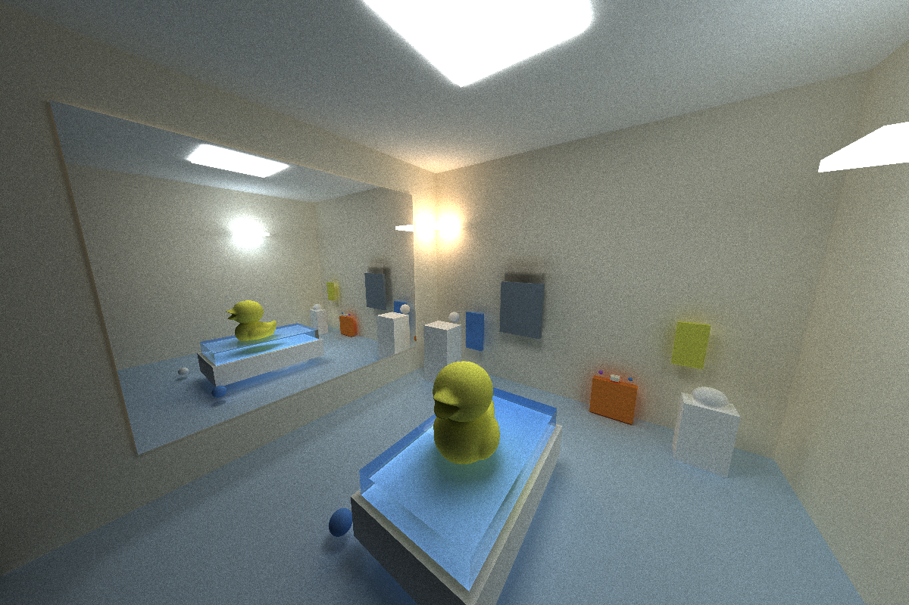
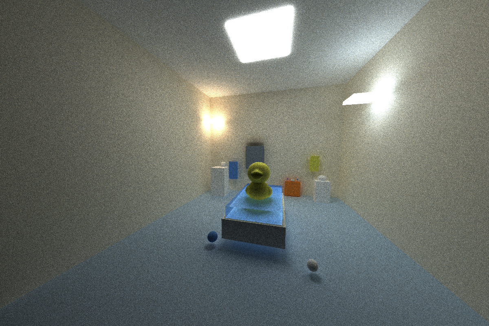
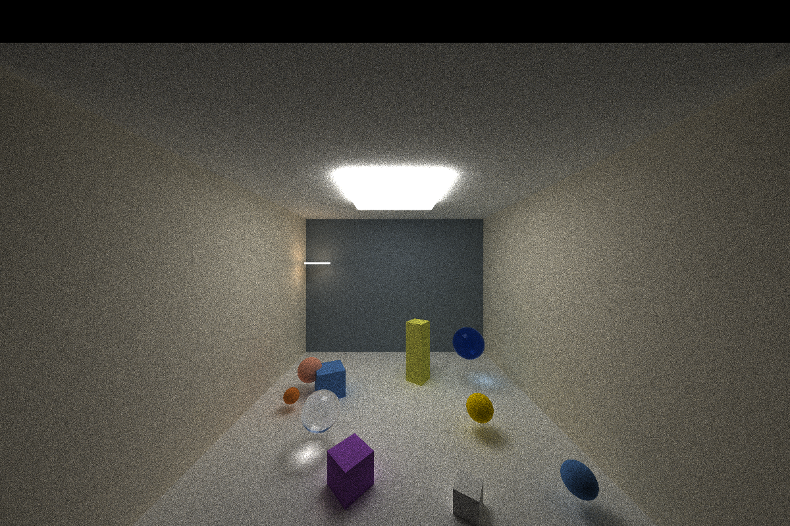
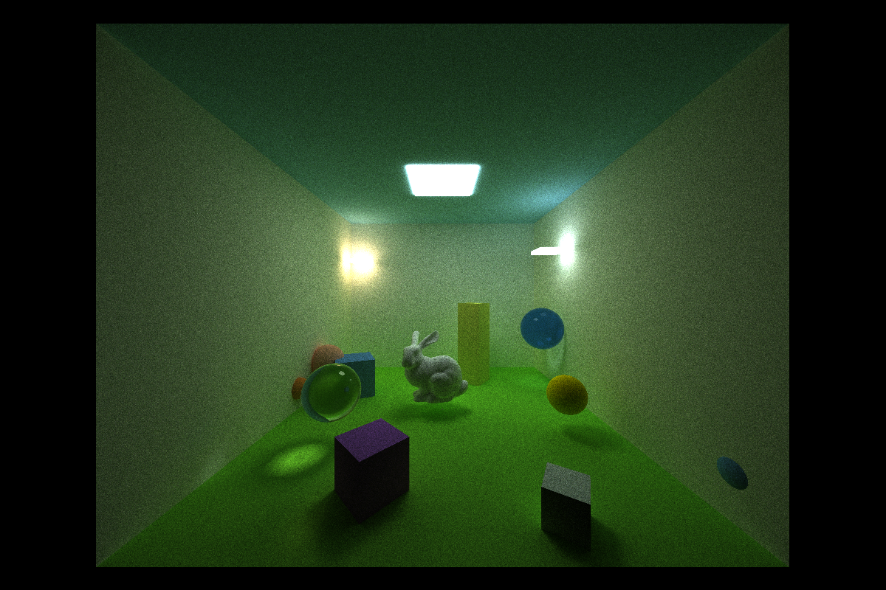

CUDA Path Tracer
================

**University of Pennsylvania, CIS 565: GPU Programming and Architecture, Project 3**

* Harris Kokkinakos
  * [LinkedIn](https://www.linkedin.com/in/haralambos-kokkinakos-5311a3210/), [personal website](https://harriskoko.github.io/Harris-Projects/)
* Tested on: Windows 24H2, i9-12900H @ 2.50GHz 16GB, RTX 3070TI Mobile

### Description

This project is a physically based Monte Carlo path tracer implemented in CUDA. It simulates global illumination by tracing rays through a scene, recursively scattering and absorbing light to approximate the rendering equation. The focus of this renderer is on leveraging GPU parallelism to achieve realistic images at interactive to near-interactive speeds. This enables efficient and physically realistic rendering of scenes. 

This path tracer supports:
*Light Transport according Diffuse, reflective, and refractive materials.
*Intersection handling for spheres, boxes, and triangles.
*GTLF Mesh loading for creation of complex scenes.
*BVH acceleration structure for efficient ray–scene intersection.
*Cosine weighted hemisphere sampling.
*Stochastic sampled antialiasing.
*Stream compaction to remove terminated rays and improve warp coherence.
*Sorting of material types in memory to reduce GPU memory lookups.

RESULTS
================
Bathtub Scene

Geometry Scenes

IMPLEMENTATION
================

### Light Transport

### Bidirectional Scattering Distribution Function

### Intersections

### GLTF Mesh loading

## Bounding Volume Heirarchy 

### Stochastic Sampled Antialiasing

### Stream Compaction

### Material Sorting

REFERENCES
================
University of Pennsylvania CIS 560 and CIS 561 Slides by Adam Mally
University of Pennsylvania CIS 565 Path Tracing Slides by Ruipeng Wang
Physically Based Rendering: From Theory To Implementation (PBRTv4) by Matt Pharr, Wenzel Jakob, and Greg Humphreys
