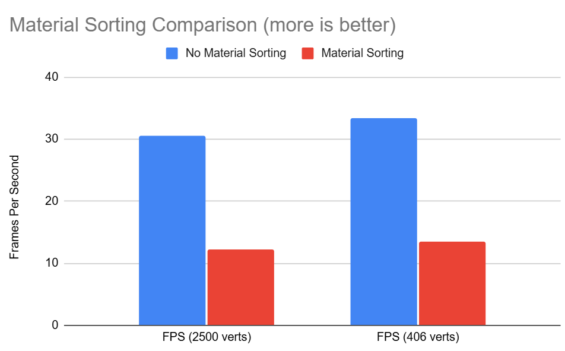

CUDA Path Tracer
================

**University of Pennsylvania, CIS 565: GPU Programming and Architecture, Project 3**

* Harris Kokkinakos
  * [LinkedIn](https://www.linkedin.com/in/haralambos-kokkinakos-5311a3210/), [personal website](https://harriskoko.github.io/Harris-Projects/)
* Tested on: Windows 24H2, i9-12900H @ 2.50GHz 16GB, RTX 3070TI Mobile

### Description

This project is a physically based Monte Carlo path tracer implemented in CUDA. It simulates global illumination by tracing rays through a scene, recursively scattering and absorbing light to approximate the rendering equation. The focus of this renderer is on leveraging GPU parallelism to achieve realistic images at interactive to near-interactive speeds. This enables efficient and physically realistic rendering of scenes. 

This path tracer supports:
1. Light Transport according Diffuse, reflective, and refractive materials.
2. Intersection handling for spheres, boxes, and triangles.
3. GTLF Mesh loading for creation of complex scenes.
4. BVH acceleration structure for efficient ray–scene intersection.
5. Cosine weighted hemisphere sampling.
6. Stochastic sampled antialiasing.
7. Stream compaction to remove terminated rays and improve warp coherence.
8. Sorting of material types in memory to reduce GPU memory lookups.

RESULTS
================
### Bathtub Scene

### Geometry Scenes

IMPLEMENTATION
================

### Light Transport

Path tracing is based on the rendering equation shown above. This equation describes how light realistically interacts with objects. At any point on a surface, the light leaving that point (Lo) is determined by the right-hand side of the equation. If the surface is a light source, we add the color of the light it emits (Le).

To handle incoming light, we consider the entire hemisphere around the surface normal. This represents all directions from which light can arrive at the point. We integrate over this hemisphere to accumulate the total light entering the point. Inside this integral, the incoming light (Li) is multiplied by two terms. The first is the Bidirectional Reflectance Distribution Function (BRDF, f), which is specific to the material of the surface. For example, a diffuse surface scatters light broadly in the hemisphere, while a specular surface reflects light more narrowly. The second is the geometry term, which accounts for the angle between the incoming light and the surface normal.

Since it is impossible to evaluate this integral exactly, we rely on Monte Carlo integration. Rather than summing over every direction, we take a limited number of random samples from the hemisphere. Each sample estimates the contribution of incoming light in its direction, weighted by the BRDF and geometry term. By averaging these random samples, we build an unbiased estimate of the true integral. Increasing the number of samples reduces noise and makes the estimate converge toward the correct solution.
### Bidirectional Scattering Distribution Function
This path tracer implements three different BSDFs:
1. Diffuse
2. Specular
3. Refraction

The implementations are influenced by Physically Based Rendering: From Theory to Implementation and Professor Adam Mally’s CIS561 course slides.

**Diffuse:**
The diffuse material samples a random direction in the hemisphere around the surface normal to scatter incoming light. This produces the characteristic rough, evenly colored appearance of matte surfaces, as shown in the results below.

**Specular:**
The specular case reflects light perfectly about the normal, producing mirror-like reflections.

**Refraction:**
Refraction allows light to pass through transparent objects, bending according to the object’s index of refraction. To simulate real glass, the implementation randomly chooses whether a ray is reflected (specular) or transmitted (refractive) based on Fresnel terms. This produces the combined reflective and transmissive behavior of glass. Attenuation within the medium is modeled using the Beer–Lambert Law. It also produces a caustic effect where the light exiting the other side of the sphere coalesces, creating a bright spot on the surface in the path of the outgoing rays. This is shown below.

### Intersections

The path tracer implements intersection tests for three primitive types: spheres, boxes, and triangles. Each geometry requires a distinct algorithm to compute where a ray strikes its surface.

**Spheres:**
Sphere intersection relies on the analytic solution to the ray-sphere equation. The ray is first transformed into the sphere's object space using the inverse transformation matrix, reducing the problem to intersecting with a unit sphere centered at the origin. A quadratic equation is formed by substituting the ray equation into the implicit sphere surface equation. The discriminant determines whether an intersection exists—if negative, the ray misses entirely. When valid, the quadratic yields two roots representing potential hit points. The code selects the appropriate root based on whether the ray hits from outside or inside the sphere, then transforms both the intersection point and surface normal back to world space.

**Boxes:**
Box intersection uses the slab method, treating the box as three pairs of parallel planes (one pair per axis). The algorithm computes where the ray enters and exits each pair of slabs, then finds where all three intervals overlap. An intersection exists if this final interval is valid (tmax ≥ tmin and tmax > 0).
For arbitrarily oriented boxes, the implementation transforms rays into object space where the box becomes axis-aligned with sides at ±0.5, performs the slab test iteratively for each axis, then transforms the intersection point and normal back to world space.

For axis-aligned bounding boxes (AABBs) used in the BVH, a streamlined version computes all three slab tests simultaneously without transformation. It inverts the ray direction once, calculates entry/exit points for all axes, and returns the overlapping interval directly. This optimized AABB test is critical for BVH traversal performance since it's called frequently during tree traversal.

**Triangles:**
Triangle intersection employs the Möller-Trumbore algorithm, which computes the hit point and barycentric coordinates in a single pass. The method solves for the ray parameter and barycentric coordinates simultaneously through a series of dot and cross products. Built-in early rejection tests ensure the ray only intersects the triangle's front face and that the hit point lies within the triangle's bounds. The barycentric coordinates are later used for interpolating vertex normals across the triangle's surface.

### GLTF Mesh Loading

The path tracer supports loading complex geometry from GLTF files, extending the renderer beyond simple primitives. GLTF (GL Transmission Format) is a standard 3D file format that stores mesh data, materials, and scene hierarchies in a compact structure suitable for GPU rendering.

The implementation uses the TinyGLTF library to parse GLTF files. For each mesh in the model, the loader extracts vertex positions, normals, and triangle indices from the file's buffer data. GLTF organizes this information through a series of accessors and buffer views, which the loader traverses to reconstruct the geometry.

Vertex positions are stored in a global vertex array, while triangle connectivity is preserved through index triplets. If a mesh includes explicit normals, those are loaded and normalized. Otherwise, the loader generates default upward-facing normals as a fallback. While GLTF files contain additional material information like roughness and metalness maps for physically based rendering, this implementation does not currently utilize these features. Future work could incorporate texture mapping and PBR shading using this stored material data.

After loading all triangles, the implementation constructs a BVH acceleration structure to enable efficient ray-triangle intersection during rendering. This allows the path tracer to handle models with thousands of triangles at interactive frame rates, as demonstrated by the rubber duck and other meshes in the rendered scenes.

### Bounding Volume Hierarchy

For scenes with complex meshes containing thousands of triangles, testing every triangle against every ray becomes computationally impossible. The BVH (Bounding Volume Hierarchy) acceleration structure addresses this by organizing triangles into a hierarchical tree of axis-aligned bounding boxes. This allows the renderer to quickly cull large portions of geometry that a ray cannot possibly intersect.

**Construction:**
The BVH is constructed on the CPU during scene loading using a top-down recursive approach. Starting with all triangles, we can split them into two groups by selecting a split axis and position. The split axis is chosen as the widest dimension of the triangles' centroid bounding box, ensuring splits occur along the direction where triangles are most spread out. Triangles are then partitioned based on whether their centroid falls to the left or right of the split position. Each node stores its bounding box and either points to two child nodes (interior nodes) or contains a list of triangles (leaf nodes). Leaf nodes are created when the triangle count drops below a threshold of 8 triangles.

**Traversal:**
During rendering, rays traverse the BVH using an explicit stack to avoid GPU recursion limitations. Starting at the root, the algorithm tests if the ray intersects the node's bounding box using the slab method. If the ray misses, the entire subtree is culled. If it hits and the node is a leaf, all triangles in that leaf are tested for intersection. If it's an interior node, both children are pushed onto the stack for further processing. This hierarchical culling dramatically reduces the number of triangle intersection tests from O(n) to O(log n) on average.

**Performance Impact:**
The BVH provides substantial performance improvements for mesh rendering. Without acceleration, every ray must test against every triangle in the scene, resulting in millions of unnecessary intersection tests. With the BVH, rays only test triangles in the bounding boxes they actually intersect, reducing wasted computation by orders of magnitude. The graph below demonstrates the performance difference between naive triangle testing and BVH-accelerated rendering.

The BVH is constructed once on the CPU and uploaded to GPU memory, where it remains static throughout rendering. This makes it well-suited for scenes with static geometry, though dynamic scenes would require rebuilding or refitting the structure each frame.

### Stochastic Sampled Antialiasing (SAA)

Aliasing produces jagged edges when a single ray per pixel either hits or misses geometry at boundaries. Stochastic antialiasing addresses this by casting multiple rays per pixel with random jitter, then averaging the results. Each ray is offset by a small random amount within the pixel's area, sampling different points. This softens sharp transitions into smooth gradients, reducing the staircase effect along edges. The randomness distributes sampling error as noise that diminishes with more samples, rather than creating regular patterns that would introduce new artifacts.

No SAA
 

With SAA

### Stream Compaction

Stream compaction removes terminated rays from the active pool between bounces. The implementation uses Thrust's partition operation to filter out rays where `remainingBounces <= 0`, keeping only active rays for the next iteration. Rays terminate when they hit emissive materials, miss geometry entirely, or reach the maximum trace depth.

However, testing revealed that stream compaction actually decreased performance in practice. The partition operation incurs overhead by traversing the ray array and shuffling memory every bounce. This cost is only justified if enough rays are culled to offset it. In enclosed scenes like the Cornell box where most rays bounce multiple times, few rays terminate early enough to make compaction worthwhile. Additionally, the memory shuffle can disrupt cache coherency by destroying spatial locality. The graph above shows this performance decrease, though in more open scenes with many escaping rays, stream compaction would likely provide greater benefit.

### Material Sorting

Similar to stream compaction, we can try and optimize the path tracer by sorting materials. This enables the GPU to shade materials that have the same material type at the same time. Ideally, this reduces overhead on the GPU since it would not need to spawn material shading kernels randomly. However, since this path tracer handles all materials in the same kernel. 

The graph above shows little to no change between using material sorting and not. If anything, there is a slight performance decrease as it takes time to sort the materials. If there were individual kernels for each material and there were more materials in the scene, this would have a more profound impact.

REFERENCES
================
University of Pennsylvania CIS 560 and CIS 561 Slides by Adam Mally

University of Pennsylvania CIS 565 Path Tracing Slides by Ruipeng Wang

Physically Based Rendering: From Theory To Implementation (PBRTv4) by Matt Pharr, Wenzel Jakob, and Greg Humphreys

Simulating Depth of Field Blurring by Paul Bourke